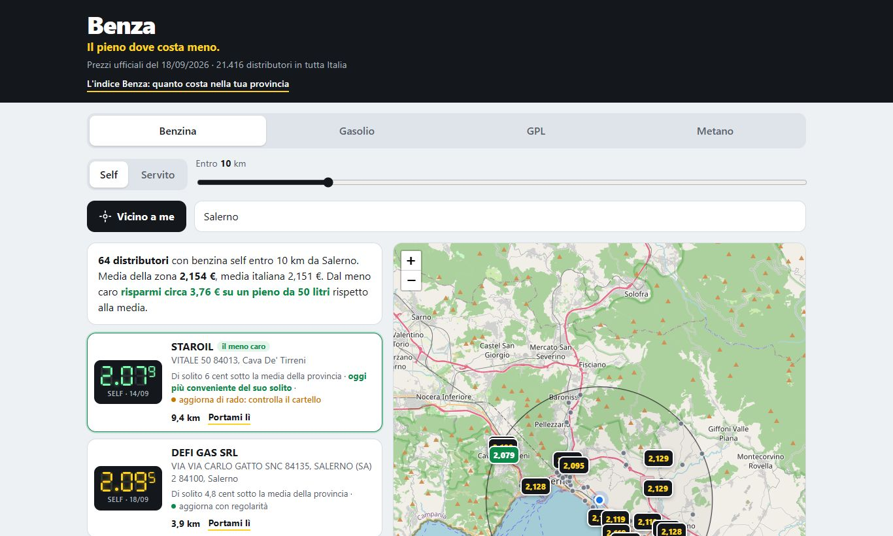
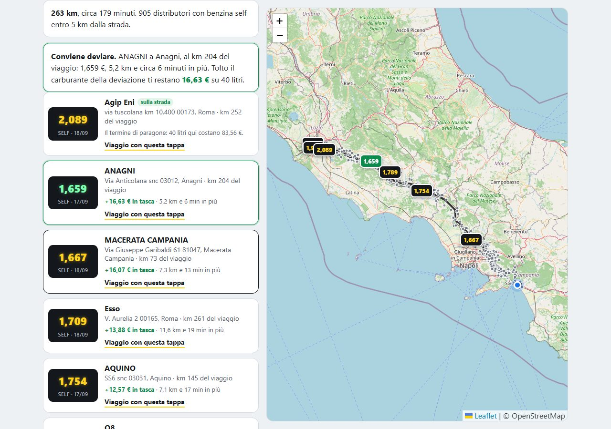

# Benza

**Il pieno dove costa meno. The cheapest fuel near you, from Italy's official price data. No ads, no sign-up, no app.**

*"Benza" is what Italians call petrol when nobody is listening.*
*[Italiano più sotto](#italiano)*



Fuel in Italy went past €2 a litre, and I wanted to compare prices without ads, accounts or tracking. The prices themselves are public: every station has to report them to the Ministry, which publishes the whole list every morning. So this is just that list, made usable.

Open the page, tap **Vicino a me** (or type a town), pick the fuel. You get the stations within your radius sorted from cheapest, on a map, with the date each price was reported and a link to navigate there.

**Live:** https://lawrence-coder-wq.github.io/benza/

## On your phone

Benza installs like an app, without any store. **Android:** open the link in Chrome and tap *Installa* (or ⋮ → *Aggiungi a schermata Home*). **iPhone:** open it in Safari, tap *Condividi* → *Aggiungi alla schermata Home*. It opens full screen, starts instantly, and with no signal it shows the last prices it downloaded, with their date.

## How it works

- `strumenti/aggiorna.py` downloads the two open-data files from the Ministry (prices at 8 am + station registry), keeps regular petrol, diesel, LPG and methane, drops prices older than 10 days and stations whose coordinates are obviously wrong (about forty of them sit 100 km outside their own province), and writes one small JSON per province into `dati/`. Standard library only.
- A GitHub Action runs it every morning and commits the new data. There is no server and no database.
- The page is static. It loads only the provinces around you (60–100 KB each), does the distance maths in your browser, and draws the prices the way the roadside totems do: seven-segment digits with the small thousandth on top. No fonts, no frameworks; the only dependency is Leaflet for the map.

## What the others don't tell you

- **Is this price good *for this station*?** From the Ministry's historical archive (a file per day since 2015) Benza learns how each station usually sits against its province's average, on the same day. So it can say "usually 5 cents below the local average, today even better", whatever the market is doing.
- **Can you trust it?** How often the station updates its price, how often the price it reported was stale or plainly wrong. The cheapest price on the list is worth little if it is ten days old: Benza says so.
- **Is the detour worth it?** Tell it where you start and where you are going (`percorso.html`): it looks at the stations within 5 km of the road, compares them with the cheapest one you meet without leaving the route, measures the extra kilometres and minutes, subtracts the fuel the detour burns and tells you what is left in your pocket. Often the honest answer is "not worth it", and it says that too.
- **The Benza index.** Every morning, the average self-service price in each province against the national average, with a ready-to-quote sentence (`indice.html`). The index history grows by one day at each update.



The history is recomputed once a month by a GitHub Action (`strumenti/storico.py`), on GitHub's servers.

## Privacy

Your position is used for the calculation on your device and never sent anywhere. No cookies, no analytics. The only things stored are your last fuel, service and radius, in `localStorage`. Map tiles come from OpenStreetMap, which sees the map area you look at, like any map. One exception, stated on the page itself: the route page asks the public OSRM routing service for the road, so OSRM receives the start, the destination and the coordinates of the stations being compared (and your position only if you choose "from my position" instead of typing a town).

## Run it yourself

```bash
python strumenti/aggiorna.py
python -m http.server 8000
```

Then open http://localhost:8000. To publish your own copy: fork, enable GitHub Pages on the `main` branch, and allow Actions to write to the repository.

## Limits, honestly

Prices are self-reported by station operators and can be wrong or late; the date is shown next to each one. Always check the sign before filling up. Premium fuels are left out on purpose, so the comparison is like for like. Motorway stations are included.

## Data and licence

Price and station data: [Ministero delle Imprese e del Made in Italy](https://www.mimit.gov.it/it/open-data/elenco-dataset/carburanti-prezzi-praticati-e-anagrafica-degli-impianti), licence IODL 2.0. Map: © OpenStreetMap contributors.
Code: MIT © 2026 Lorenzo Paoletta.

---

## Italiano

**Il distributore meno caro vicino a te, dai dati ufficiali. Senza pubblicità, senza registrazione, senza app.**

Con la benzina sopra i 2 euro volevo confrontare i prezzi senza pubblicità, senza account e senza essere tracciato. I prezzi, del resto, sono pubblici: ogni gestore deve comunicarli al Ministero, che ogni mattina pubblica l'elenco completo. Questo progetto è quell'elenco, reso usabile.

Apri la pagina, tocca **Vicino a me** (o scrivi un comune), scegli il carburante. Vedi i distributori entro il raggio che vuoi, dal meno caro, sulla mappa, con la data in cui il prezzo è stato comunicato e il collegamento per farti portare lì.

**Online:** https://lawrence-coder-wq.github.io/benza/

### Sul telefono

Benza si installa come un'app, senza passare da nessuno store. **Android:** apri il link con Chrome e tocca *Installa* (oppure ⋮ → *Aggiungi a schermata Home*). **iPhone:** aprilo con Safari, tocca *Condividi* → *Aggiungi alla schermata Home*. Si apre a tutto schermo, parte subito e, se non c'è campo, mostra gli ultimi prezzi scaricati con la loro data.

### Come funziona

- `strumenti/aggiorna.py` scarica i due file aperti del Ministero (prezzi delle 8 e anagrafica degli impianti), tiene benzina, gasolio, GPL e metano normali, scarta i prezzi più vecchi di 10 giorni e gli impianti con coordinate palesemente sbagliate (una quarantina risultano a 100 km dalla propria provincia), e scrive in `dati/` un file piccolo per provincia. Solo libreria standard di Python.
- Un'azione di GitHub lo esegue ogni mattina e salva i dati nuovi. Non c'è nessun server e nessun database.
- La pagina è statica. Carica solo le province intorno a te (60–100 KB l'una), calcola le distanze nel tuo browser e disegna i prezzi come i totem lungo la strada: cifre a sette segmenti col millesimo piccolo in alto. Niente caratteri da scaricare, niente framework: l'unica dipendenza è Leaflet per la mappa.

### Quello che gli altri non dicono

- **Questo prezzo è buono *per questo distributore*?** Dall'archivio storico del Ministero (un file al giorno dal 2015) Benza impara come si comporta di solito ogni impianto rispetto alla media della sua provincia, nello stesso giorno. Così può dire «di solito 5 centesimi sotto la media, oggi anche meglio», qualunque cosa faccia il mercato.
- **Ci si può fidare?** Ogni quanto il distributore aggiorna il prezzo, quante volte ne ha comunicato uno vecchio o palesemente sbagliato. Il prezzo più basso della lista vale poco se è fermo da dieci giorni: Benza lo dice.
- **Conviene la deviazione?** Gli dici da dove parti e dove arrivi (`percorso.html`): guarda i distributori entro 5 km dalla strada, li confronta con il meno caro che incontri senza uscire dal percorso, misura i chilometri e i minuti in più, toglie il carburante che bruci per deviare e ti dice quanto resta in tasca. Spesso la risposta onesta è «non conviene», e lo dice.
- **L'indice Benza.** Ogni mattina il prezzo medio del self in ogni provincia contro la media italiana, con la frase pronta da citare (`indice.html`). Lo storico dell'indice cresce di un giorno a ogni aggiornamento.

Lo storico si ricalcola una volta al mese con un'azione di GitHub (`strumenti/storico.py`), sui server di GitHub.

### Riservatezza

La posizione serve al calcolo sul tuo dispositivo e non viene inviata a nessuno. Niente cookie, niente statistiche. Si ricordano solo l'ultimo carburante, il servizio e il raggio, nel tuo browser. Le mattonelle della mappa arrivano da OpenStreetMap, che vede la zona di mappa che guardi, come per qualsiasi mappa. Un'eccezione, scritta anche sulla pagina: la pagina del percorso chiede la strada al servizio pubblico OSRM, che quindi riceve partenza, arrivo e le coordinate dei distributori da confrontare (la tua posizione solo se scegli «Dalla mia posizione» invece di scrivere il comune).

### Limiti, detti chiaramente

I prezzi li comunicano i gestori e possono essere sbagliati o in ritardo: accanto a ognuno c'è la data. Controlla sempre il cartello prima di fare rifornimento. I carburanti speciali sono esclusi apposta, così il confronto è alla pari. Gli impianti autostradali sono compresi.

### Dati e licenza

Prezzi e impianti: Ministero delle Imprese e del Made in Italy, licenza IODL 2.0. Mappa: © OpenStreetMap e chi vi contribuisce.
Codice: MIT © 2026 Lorenzo Paoletta.
